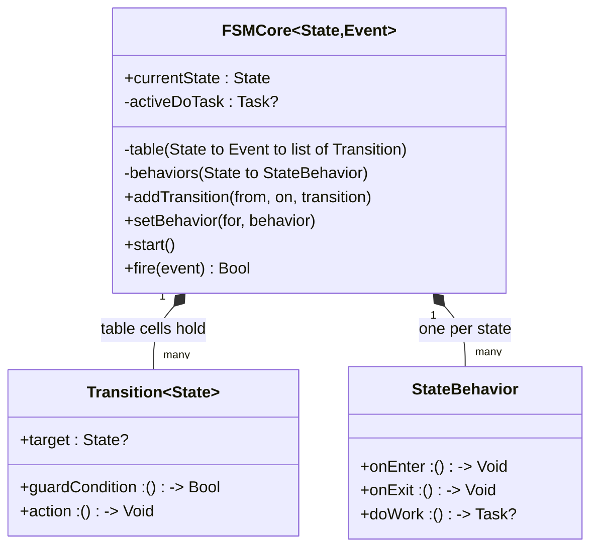
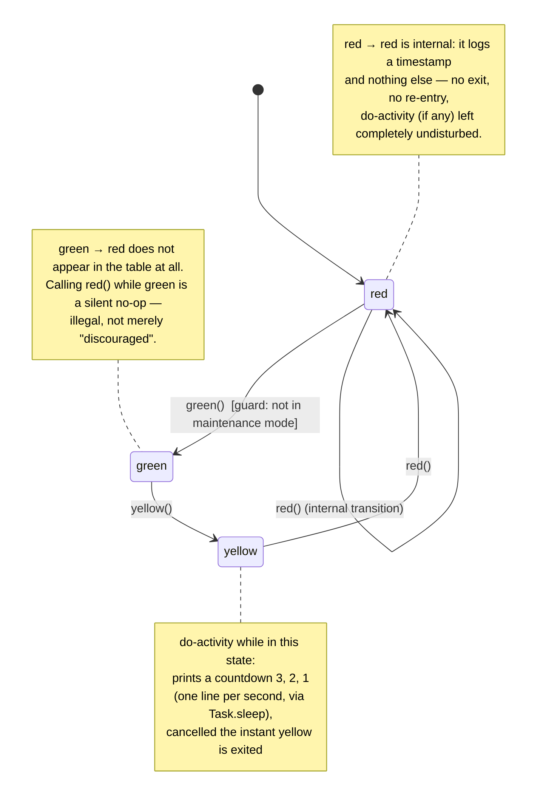
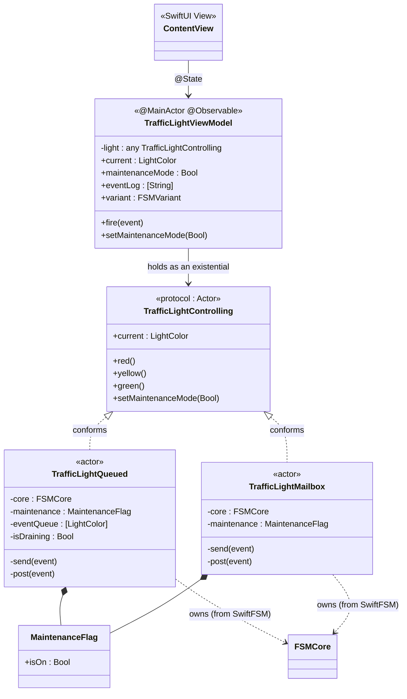
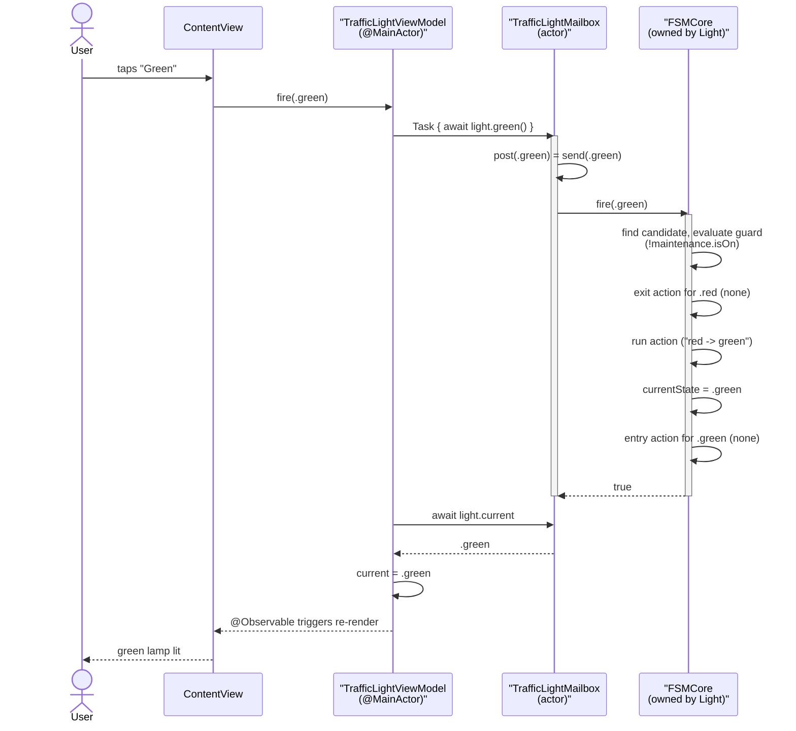
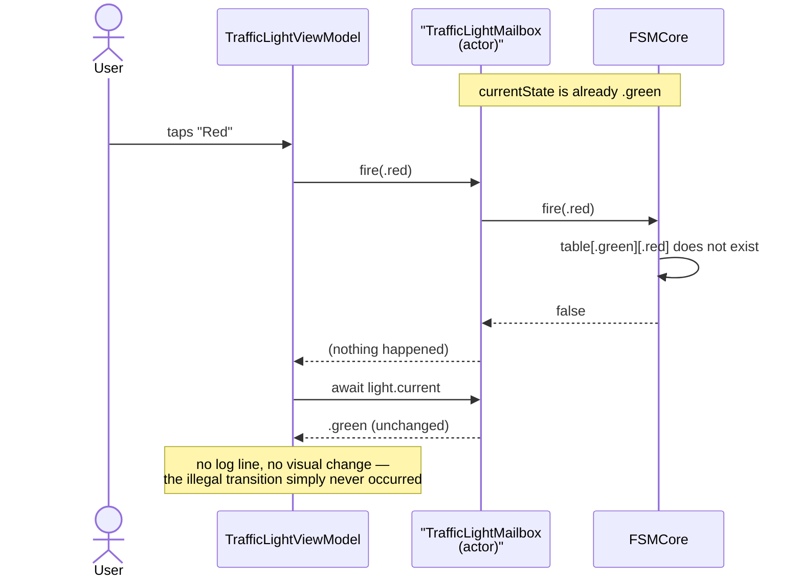
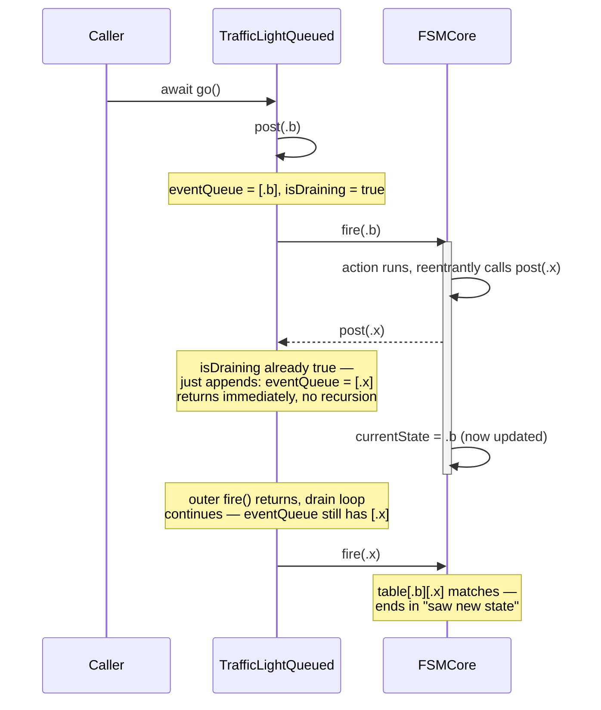
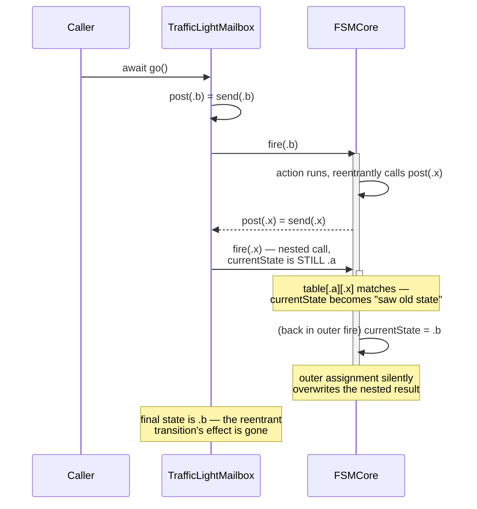
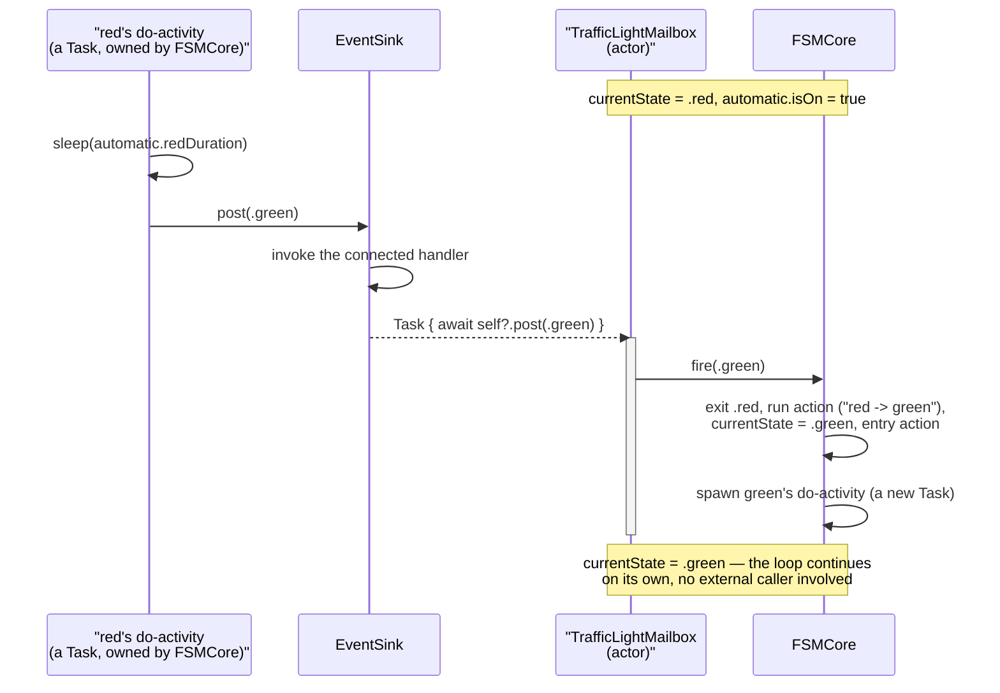
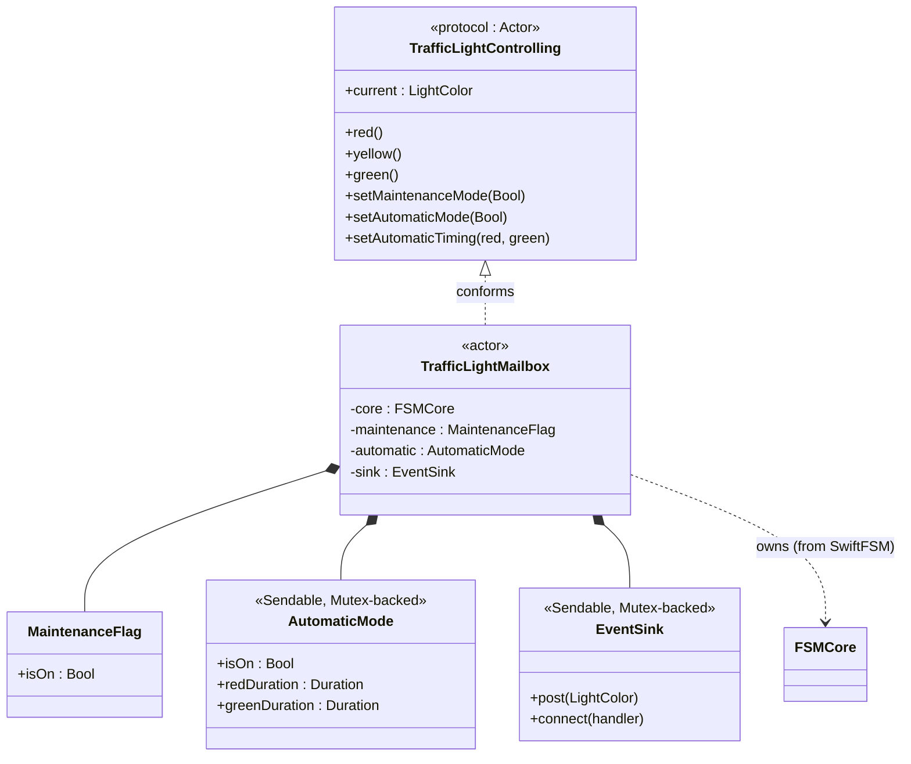

# SwiftFSM — A Actor-Based Finite State Machine, with a Traffic Light

This document explains what's in this repository, how it works, and why it's
built the way it is. It assumes no prior familiarity with the project — if
you're picking this up for the first time, start here.

## 1. What this is

This repository contains two things:

1. **`SwiftFSM`** — a small Swift package implementing a *flat statechart*
   engine: states, events, guarded transitions, entry/exit actions, and a
   long-running "do-activity" per state. It has no dependency on Swift
   Concurrency, SwiftUI, or anything else — it's a plain, synchronous
   library.
2. **`TrafficLight`** — a sample app (iOS, iPadOS, and macOS) that uses
   `SwiftFSM`, wrapped in a Swift `actor`, to drive an actual red/yellow/green
   traffic light with a SwiftUI interface. It exists to demonstrate the
   engine and, specifically, to compare **two different ways an actor can
   expose an event queue to its callers.**

The traffic light is intentionally simple as a *domain* — the interesting
part is everything around it: how a table-driven state machine maps onto
Swift's actor model, and what changes when you build it under Swift 6's
strict concurrency checking.

### Project layout

```
StateMachine/                        (repository root)
├── StateMachineContext.md           this document
├── StateMachine.xcodeproj           the "TrafficLight" app target
├── StateMachine/                    app source
│   ├── TrafficLightApp.swift        @main entry point
│   ├── ContentView.swift            SwiftUI view
│   ├── TrafficLightViewModel.swift  @MainActor bridge between the UI and the actor
│   └── TrafficLight.swift           the domain: LightColor, the two actors
└── SwiftFSM/                        the engine, as a local Swift package
    ├── Package.swift
    ├── Sources/SwiftFSM/
    │   ├── Transition.swift
    │   ├── StateBehavior.swift
    │   └── FSMCore.swift
    └── Tests/SwiftFSMTests/
        └── FSMCoreTests.swift
```

`TrafficLight` depends on `SwiftFSM` as a local Swift package dependency.
`SwiftFSM` has no knowledge of traffic lights, actors, or SwiftUI — it's a
generic `<State, Event>` engine that any domain could plug into.

## 2. The core idea

A state machine can be described as a table: for each `(currentState, event)`
pair, look up what should happen. If there's an entry, run it and update the
state; if there isn't, do nothing. That's the entire dispatch algorithm —
the rest is bookkeeping around it (guards to pick between candidates,
actions to run, entry/exit hooks, a background activity tied to the current
state).

The one property that matters most for correctness is **serialization**:
only one event should ever be "in flight" through the table at a time. If
two events could be processed concurrently, you could read `currentState`
while it's being written, or run two conflicting actions at once.

Swift's `actor` type gives you that serialization for free. An actor's
**mailbox** — the runtime's queue of pending calls into the actor — plays
exactly the role a hand-rolled event queue would: any two calls into the
same actor from outside are automatically serialized, one at a time. That's
the whole reason this engine is built as something an actor *owns*, rather
than as an actor itself (more on that distinction in §5).

## 3. The engine: `SwiftFSM`

Three types make up the whole package.



### `Transition<State>`

A single candidate response to an event, in a given state:

- `guardCondition: () -> Bool` — must return `true` for this candidate to be
  chosen. Defaults to always-true.
- `action: () -> Void` — runs if this candidate is chosen.
- `target: State?` — where to go. This is the interesting part:
  - **non-nil** → an *external transition*: exit the current state, run the
    action, change state, enter the new state (which may be the same state
    you started in — see "external self-transition" below).
  - **nil** → an *internal transition*: run the action and nothing else. No
    exit, no entry, no state change, and critically, no disruption to
    whatever the state's do-activity is doing.

Both `guardCondition` and `action` are declared `@autoclosure`, so call sites
read as plain expressions rather than boilerplate closures:

```swift
Transition(to: .green, guard: !maintenance.isOn, action: log("red -> green"))
```

Because `@autoclosure` defers evaluation, `guardCondition` is a *live* read
of whatever state it closes over — evaluated fresh every time the engine
considers this candidate, not a snapshot taken when the table was built.

If more than one `Transition` is registered for the same `(state, event)`,
the engine picks the **first one whose guard passes**. That's what lets one
event resolve differently depending on runtime conditions — e.g. "go green,
but only if we're not in maintenance mode."

### `StateBehavior`

Attached to a *state* (not a transition): an entry action, an exit action,
and a `doWork` factory.

`doWork: () -> Task<Void, Never>?` is the mechanism for a **do-activity** —
work that runs only while the machine is in this state. It's a factory, not
a `Task` itself: every time the state is entered, `doWork()` is called fresh
and whatever `Task` it returns is tracked. The moment the state is exited
(or another transition fires out of it), that task is cancelled. Wrapping it
in `@autoclosure` means you write it at the call site as if it were just a
`Task { ... }` value, but its *creation* is deferred to whenever the engine
actually needs a new one:

```swift
StateBehavior(
    onEnter: log("entering YELLOW"),
    doWork: Task {
        for secondsLeft in stride(from: 3, through: 1, by: -1) {
            if Task.isCancelled { return }
            log("  yellow countdown: \(secondsLeft)")
            try? await Task.sleep(nanoseconds: 1_000_000_000)
        }
    }
)
```

### `FSMCore<State, Event>`

The table, the current-state bookkeeping, and `fire(_:)` — the actual
dispatch logic. It is a **plain class**, not an actor, and it is
**not thread-safe on its own**. It has no locks, no queues, nothing. It
works correctly only because exactly one actor owns an instance of it
privately and is the only thing that ever calls into it — the actor's
mailbox is what supplies the serialization `FSMCore` itself doesn't provide.
This is a deliberate split: the engine is dumb and synchronous by design, so
it never has to make its own decisions about concurrency; the actor wrapping
it makes those decisions once, in one place.

`fire(_:)` mirrors what you'd expect from the description above:

```swift
func fire(_ event: Event) -> Bool {
    guard let candidates = table[currentState]?[event],
          let transition = candidates.first(where: { $0.guardCondition() })
    else { return false }                          // no match — silent no-op

    guard let target = transition.target else {
        transition.action()                         // internal transition
        return true
    }

    activeDoTask?.cancel()                           // external transition:
    if let exit = behaviors[currentState]?.onExit { exit() }
    transition.action()
    currentState = target
    if let enter = behaviors[currentState]?.onEnter { enter() }
    activeDoTask = behaviors[currentState]?.doWork()
    return true
}
```

Two things worth noticing, because they come up again later:

- **No table entry means silent failure, not an error.** If
  `table[currentState]?[event]` is `nil`, `fire` just returns `false`. This
  is what makes an illegal transition *structurally impossible to observe as
  a real transition* — there's nothing to catch, because nothing happened.
- **The action runs before `currentState` is updated.** This is standard —
  the action is logically "what happens on the way out of the old state" —
  but it has a real consequence if that action turns around and posts
  another event back into the same machine. See §6.

The table itself is a nested dictionary,
`[State: [Event: [Transition<State>]]]`. A plain 2D array (indexed by a
`rawValue`) would also work for a `State`/`Event` pair that happens to be
small contiguous enums, but a dictionary handles any `Hashable` type, stays
readable when most cells are legitimately empty (the normal case — most
states don't handle most events), and gives "no transition" for free via
`nil`, with no sentinel value needed.

## 4. The state chart, as a picture

The sample app wires up a `LightColor` enum (`red`, `yellow`, `green`) as
both the state type and the event type — an event means "go to this color."
Here's the whole thing:



A few of these are worth calling out explicitly, because each one
demonstrates a specific engine feature:

- **`red → green` is guarded.** It only succeeds if `!maintenance.isOn`.
  Toggle maintenance mode on, and the same `green()` call becomes a no-op —
  same event, same state, different outcome, because the guard is
  re-evaluated live every time.
- **`green → red` doesn't exist.** There's no way to skip straight from
  green to red. This is the whole point of a table-driven design: the
  illegal transition isn't rejected by a check, it's simply absent, so
  there's nothing to forget to check.
- **`red → red` is an *internal* transition.** Calling `red()` while
  already red logs a timestamp and does nothing else — no exit, no
  re-entry, no state change. If this were instead modeled as an *external*
  self-transition (`target: .red` instead of `target: nil`), it would fire
  the exit and entry actions and restart any do-activity, which is the
  right behavior when you *want* a reset (e.g. restarting a countdown) and
  the wrong behavior when you just want to log something in passing.
- **`yellow`'s do-activity** is the only state with background work
  attached. It runs only while the machine is in `yellow`, and is cancelled
  the instant the machine leaves — whether that's because the 3-second
  countdown never has a chance to reach 1, or because something else fired
  a transition out of `yellow` early.

## 5. The app: two actors, one shared engine

Both actors below own a private `FSMCore<LightColor, LightColor>` and expose
the same domain API: `red()`, `yellow()`, `green()`, `setMaintenanceMode(_:)`,
and a `current` property. Neither exposes anything that would let a caller
know a table, a queue, or an actor mailbox is involved.



`TrafficLightControlling` is what lets `TrafficLightViewModel` hold *either*
actor behind one variable (`any TrafficLightControlling`) and switch between
them at runtime — the segmented control at the top of the app picks which
one is currently driving the light. Both variants share every line of table
wiring (guards, actions, entry/exit, the countdown) via one free function,
`buildTrafficLightCore`. They differ in exactly one place: how `post`
works.

### Variant 1 — `TrafficLightQueued`: an explicit queue

```swift
private func post(_ event: LightColor) {
    eventQueue.append(event)
    guard !isDraining else { return }   // reentrant post just enqueues
    isDraining = true
    while !eventQueue.isEmpty {
        send(eventQueue.removeFirst())
    }
    isDraining = false
}
```

This keeps its own `[LightColor]` array and an `isDraining` flag. `post`
appends to the array; only the *outermost* call actually drains it,
processing events one at a time until the queue is empty. A call to `post`
that happens while a drain is already in progress (a **reentrant** call —
see §6) just appends and returns immediately.

### Variant 2 — `TrafficLightMailbox`: the actor's own mailbox

```swift
private func post(_ event: LightColor) {
    send(event)   // the mailbox itself is the queue
}
```

No explicit queue at all. `post` calls `send` directly. The actor runtime's
own mailbox is what serializes concurrent *external* callers — two
different `Task`s both calling `await light.green()` at the same time will
still only ever run one at a time, because that's just how actors work.

### A legal transition, end to end



### An illegal transition, end to end



## 6. Reentrancy: where the two variants actually differ

For everything the traffic light itself does, `TrafficLightQueued` and
`TrafficLightMailbox` behave identically, because every action in the demo
is a synchronous `print`-like call. The two variants only diverge in a
scenario the traffic light doesn't happen to exercise: **an action that
itself calls back into `post`, reentrantly, while the outer transition is
still in progress.**

Recall from §3 that `fire(_:)` runs the transition's `action` *before*
updating `currentState`. That ordering matters a lot once you allow
reentrancy, and the two variants handle it in genuinely different ways —
not just "one is more introspectable," but one of them can silently discard
work.

**Variant 1 (`TrafficLightQueued`)** — a reentrant `post` call, made from
inside an action, finds `isDraining` already `true` and just appends to the
queue without recursing. The outer transition finishes completely —
including updating `currentState` — *before* the drain loop picks up the
queued event and processes it. The reentrant event always sees a fully
settled state.

**Variant 2 (`TrafficLightMailbox`)** — `post` calls `send` directly, so a
reentrant `post` call recurses immediately, synchronously, *while the outer
`fire` call is still on the stack* — before `currentState = target` has
run. Whatever the nested call does to `currentState` gets **silently
overwritten** the moment the outer call resumes and reaches its own
`currentState = target` line.

This was verified directly (not just reasoned about) with a small
three-state harness: state `a`, a transition `a → b` whose action
reentrantly posts a third event, and two candidate destinations for that
event — one reachable only if the reentrant call sees the *old* state
(`a`), one only if it sees the *new* state (`b`). The observed results:





The practical takeaway: if you know every action in your machine will only
ever be a leaf call — never itself posting another event — the two variants
really are interchangeable, and `TrafficLightMailbox` is simpler. The moment
an action might cascade into another event, `TrafficLightQueued`'s explicit
drain loop gives you deterministic, non-clobbering ordering; the raw mailbox
does not.

Both variants share one caveat regardless: actors serialize *execution*,
not *time* — they only guarantee no interleaving *between* `await` points.
If an action needs to genuinely suspend (real I/O, a delay, a call to
another actor), doing that from inside `fire`'s call stack reopens the door
to interleaving from other external callers, queue or no queue. The rule
this engine assumes throughout: **actions and guards are synchronous,
non-suspending code.** If a transition genuinely needs async work, do it
*before* calling `post`, then post the resulting event — never `await` from
inside an action itself.

## 7. A Swift 6 wrinkle: actors can't wire themselves up in `init`

While building this, one specific piece of the original design didn't
survive contact with Swift 6's strict concurrency checking, and it's worth
explaining because the failure mode is non-obvious.

The natural way to write a guard that reads live actor state is:

```swift
actor TrafficLightQueued {
    private var maintenanceOn = false
    init() {
        core.addTransition(from: .red, on: .green,
            Transition(to: .green, guard: !self.maintenanceOn))
    }
}
```

This does not compile under Swift 6. An actor's own synchronous `init` is
allowed to read and write its stored properties directly, but it is **not**
considered part of the actor's isolation domain for anything else: it can't
call the actor's own other isolated methods, and any escaping closure
formed inside it can't capture `self` either. The reasoning is that the
actor's isolation domain — the thing that makes it safe to touch actor
state without `await` — doesn't really exist until construction finishes,
so nothing created *during* construction can be trusted to run "on the
actor" later.

The fix used here: the one piece of mutable state a guard needs
(`maintenance.isOn`) lives in a tiny plain (non-actor) box, `MaintenanceFlag`,
and the whole table is built by a free function, `buildTrafficLightCore`,
that captures the *box* instead of `self`:

```swift
private final class MaintenanceFlag {
    var isOn = false
}

private func buildTrafficLightCore(
    maintenance: MaintenanceFlag,
    logger: @escaping @Sendable (String) -> Void
) -> FSMCore<LightColor, LightColor> {
    let core = FSMCore<LightColor, LightColor>(initialState: .red)
    core.addTransition(from: .red, on: .green,
        Transition(to: .green, guard: !maintenance.isOn, action: logger("red -> green")))
    // ...
    return core
}

actor TrafficLightQueued: TrafficLightControlling {
    private let core: FSMCore<LightColor, LightColor>
    private let maintenance = MaintenanceFlag()

    init(logger: @escaping @Sendable (String) -> Void = { print($0) }) {
        core = buildTrafficLightCore(maintenance: maintenance, logger: logger)
        core.start()
    }
    func setMaintenanceMode(_ on: Bool) { maintenance.isOn = on }
}
```

This still gives the guard a *live* read (`maintenance.isOn` is read fresh
every time the guard runs) and it's still exactly as safe as `FSMCore`
itself — safe because it's exclusively owned and only ever touched from
inside the actor's isolated methods once construction is done, not because
the type system enforces it. It just moves the capture target from `self`
(disallowed during `init`) to a plain object (allowed anywhere).

The upshot for anyone extending this pattern: **any mutable state your
guards need to read must live outside `self` if it's going to be wired up
during `init`.** If you'd rather keep it as an actor-isolated `var`, the
alternative is to build the table in a separate method and call it *after*
construction (e.g. an `await light.activate()` the caller runs once), since
by then the actor's isolation domain is fully live — at the cost of an
extra step every caller has to remember.

## 8. The sample app

`TrafficLightViewModel` is a `@MainActor`, `@Observable` class that owns
`any TrafficLightControlling` and republishes its state for SwiftUI:

- `fire(_:)` spawns a `Task` that awaits the appropriate actor method, then
  re-reads `current` from the actor and assigns it — SwiftUI observes the
  assignment and re-renders.
- `setMaintenanceMode(_:)` updates its own `maintenanceMode` synchronously
  (so the toggle animates immediately) and separately tells the actor.
- Switching `variant` tears down the current actor and builds a fresh one
  in its initial (`red`) state, clearing the event log — and carries the
  current `maintenanceMode` value over to the new actor, so the toggle and
  the actor's actual guard state never disagree.

`ContentView` is a lit lamp housing (three circles, the current color at
full opacity, the others dimmed), a row of `Red` / `Yellow` / `Green`
buttons, a maintenance-mode toggle, a segmented control to switch between
the two `post` variants live, and a scrolling event log that mirrors every
`print`-style call the engine makes internally — so the guard evaluation,
entry/exit actions, the countdown, and the internal-transition timestamp
are all visible on screen, not just in the Xcode console.

## 9. Testing

`SwiftFSMTests` (Swift Testing) exercises `FSMCore` directly, independent of
actors or the traffic light domain, covering: a legal transition firing
exit/action/entry in order; a missing table entry being a silent no-op; the
first passing guard among multiple candidates winning; an internal
transition running its action without touching state, entry, or exit; an
external self-transition re-running entry/exit; and a do-activity being
cancelled on exit and restarted fresh on re-entry.

```bash
cd SwiftFSM && swift test
```

## 10. Requirements

Both targets build in Swift 6 language mode with complete concurrency
checking. The app currently targets iOS/iPadOS 26.6 and macOS 27.0 as
minimums; the `SwiftFSM` package itself only requires iOS 18 / macOS 15 (it
needs nothing newer than that — the higher app-level floor is a project
choice, not an engine requirement).

## 11. Explicitly out of scope

What's implemented is a **flat** statechart: guards, entry/exit actions, a
do-activity, and internal-vs-external transitions — but not nested/composite
states or history states, which would be needed for a true Harel statechart.
That extension would require:

- `State` expressing a parent/child relationship (composite states).
- `FSMCore` tracking a *stack* of active states rather than a single
  `currentState`, with event lookup bubbling from the innermost active state
  up through its ancestors when no local match is found.
- Some representation of history (shallow/deep) for re-entering a composite
  state at whatever child state it was last in, rather than always at a
  fixed default child.

Nothing else is deferred — guards, entry/exit, do-activity, internal-vs-
external transitions, and the two `post` variants are all fully implemented
and tested.

---

# Addendum: Automatic (Scheduled) Mode

Everything above described the traffic light as originally shipped: it only
ever changes state in response to a manual `red()`/`yellow()`/`green()`
call — a "manual mode" traffic light, even though nothing above called it
that, because there was no other mode yet. This addendum covers a later
addition: an **automatic mode**, where the light runs itself on a timer —
`red` for a while, then `green`, then the existing `yellow` countdown, then
back to `red`, indefinitely, exactly like a real traffic light — while
manual mode keeps working exactly as documented above whenever automatic
mode is off.

Per the project's documentation practice, this section is appended rather
than rewriting anything above. Where something below refines or corrects an
earlier claim, that's called out explicitly rather than silently editing
the original — the goal is to preserve *why* decisions were made and where
earlier understanding turned out to be incomplete, not just the current
state of the code.

## 12. Where should scheduling logic live?

Before writing any code, the open question was architectural: does
"advance to the next color on a timer" belong inside the state machine
(the engine layer — `SwiftFSM`/the actors), or in the application layer
(`TrafficLightViewModel`, watching `current` and arming its own timers)?

**The case for the application layer:** it touches none of the
concurrency-sensitive actor/`init` code, and it mirrors how real traffic
signal controllers are actually built — "phase logic" (what states/
transitions are legal) is typically kept separate from the "timing plan"
(how long each phase runs), so that timing can be reconfigured without
touching the logic that defines what's legal.

**The case for the engine layer:** the state graph itself doesn't change
between manual and automatic mode — only *what triggers* an existing,
already-legal transition changes, from a tap to a timer. That's a strong
signal the mechanism belongs where the state graph lives. More concretely,
`StateBehavior.doWork` — the do-activity mechanism `yellow`'s countdown
already used — is *exactly* "run this while in the state, cancelled the
instant the state is left for any other reason." A scheduled auto-advance
is a do-activity that, instead of only logging, closes the loop back into
the state machine. Building it anywhere else means re-deriving that
cancel-on-any-transition guarantee by hand.

**Decision:** the engine layer, with the *policy* — whether automatic mode
is on, and how long `red`/`green` last — injected as plain data, the same
way `MaintenanceFlag` is already injected into the guard on `red → green`.
This gets the do-activity's free cancellation semantics without hardcoding
the timing, so the values remain swappable without touching the wiring.

## 13. `AutomaticMode`: a policy box that has to be genuinely `Sendable`

```swift
final class AutomaticMode: Sendable {
    private struct State {
        var isOn = false
        var redDuration: Duration = .seconds(4)
        var greenDuration: Duration = .seconds(4)
    }
    private let lock = Mutex(State())

    var isOn: Bool {
        get { lock.withLock { $0.isOn } }
        set { lock.withLock { $0.isOn = newValue } }
    }
    var redDuration: Duration {
        get { lock.withLock { $0.redDuration } }
        set { lock.withLock { $0.redDuration = newValue } }
    }
    var greenDuration: Duration {
        get { lock.withLock { $0.greenDuration } }
        set { lock.withLock { $0.greenDuration = newValue } }
    }
}
```

This looks at first like it should just be `MaintenanceFlag` with two more
fields — a plain class, mutated directly, read live by a guard. It can't be,
for a reason `MaintenanceFlag` never had to face: `MaintenanceFlag` is only
ever read from a synchronous, non-`Sendable`, non-escaping-in-the-relevant-
sense guard closure, always executing on the actor's own call stack. This
box is read from **inside a `Task` body** — the timer itself — and a `Task`
initializer's operation closure genuinely is checked for `Sendable`
captures, because it really can run concurrently with whatever else the
actor is doing. Capturing a plain mutable class there was rejected outright
by the compiler (verified directly — seeing the actual diagnostic rather
than assuming, since this is exactly the kind of assumption worth checking):

```
error: passing closure as a 'sending' parameter risks causing data races
between code in the current isolation context and concurrent execution of
the closure
```

`Mutex` (from the `Synchronization` module, shipped alongside Swift 6.0)
fixes this properly rather than papering over it. The type was first tried
with Apple's older `OSAllocatedUnfairLock`, which required declaring the
class `@unchecked Sendable` — an escape hatch, asserting safety rather than
having it checked. Switching to `Mutex` let the class be declared as plain,
*checked* `Sendable` — no `@unchecked` anywhere. Concretely better, not just
a style preference: the compiler verifies the safety claim through `Mutex`'s
own guarantees instead of trusting an assertion. It also drops the
Darwin-specific `import os` in favor of `Synchronization`, a portable
Swift-language module — irrelevant to this Apple-only app functionally, but
a more honest import for what the code is actually doing.

## 14. What broke while wiring it up, and what that revealed about §7

§7 described actor `init` as: can read/write stored properties directly,
can't call other isolated methods, can't form escaping closures capturing
`self`. That's true, but implementing automatic mode required calling a
closure back into the *same* actor from a do-activity — which meant
building a closure in `init` that captures `self`, weakly, only to defer
all real interaction to a nested `Task { await self?.post(event) } }`. That
specific shape was tested in isolation first and does compile even inside
`init`. The problem was everything *around* it.

The actual, more precise rule, found only by hitting the compiler with the
real shape of the code (not by reasoning about it in the abstract) is
**stricter and order-sensitive**: once *any* statement in `init` forms a
closure capturing `self` — even weakly, even one that never synchronously
touches actor state — **every subsequent statement** in that `init` is
barred from touching *any* actor-isolated stored property. Not just calling
methods; not just the property the closure is related to; not just
properties without a default value. All of them, for the rest of `init`,
in statement order. This is stricter than §7's description, which — read
literally — would suggest only the closure's *own* body is restricted.

Concretely, this rejected the first attempt at `TrafficLightMailbox.init`:

```swift
// Rejected — `core` used before being initialized / cannot access
// property 'core' here in nonisolated initializer:
init(logger: ...) {
    core = buildTrafficLightCore(
        maintenance: maintenance,
        automatic: automatic,
        logger: logger,
        postEvent: { [weak self] event in Task { await self?.post(event) } }
    )
    core.start()
}
```

Extracting the closure to its own `let` statement first didn't help either
— the taint applies from the first self-capturing closure onward,
regardless of which statement contains it. An immediately-invoked closure
(`core = { ...; return c }()`) didn't help either; that form gets inferred
nonisolated in its own right, for a different reason, and rejects reading
`self`'s properties even *before* any self-capture appears inside it.

What actually works, verified end to end with a minimal three-property
scratch actor before touching the real code: do every *plain* property
read first, across as many statements as needed, then form the
self-capturing closure exactly once, as the **last** statement in `init`.
The fix was to stop trying to hand a self-capturing closure to
`buildTrafficLightCore` at all, and instead give it a mutable-but-genuinely-
`Sendable` box that starts disconnected and gets connected last:

```swift
/// How a do-activity's timer gets a new event back into the actor that
/// owns it, once the timer fires. Two-step by necessity: the transition
/// table is built *before* the owning actor exists (see §7), referencing
/// this box instead of `self`. The box starts with no handler connected;
/// a self-capturing handler is connected as the very last statement in
/// `init`, once every other stored property has already been read.
final class EventSink: Sendable {
    private let handler = Mutex<(@Sendable (LightColor) -> Void)?>(nil)

    func post(_ event: LightColor) {
        if let handler = handler.withLock({ $0 }) { handler(event) }
    }

    func connect(_ handler: @escaping @Sendable (LightColor) -> Void) {
        self.handler.withLock { $0 = handler }
    }
}
```

```swift
init(logger: @escaping @Sendable (String) -> Void = { print($0) }) {
    core = buildTrafficLightCore(maintenance: maintenance, automatic: automatic, sink: sink, logger: logger)
    core.start()
    // Must be the last statement in init — see EventSink's doc comment.
    sink.connect { [weak self] event in
        Task { await self?.post(event) }
    }
}
```

There's no race between `core.start()` (which may immediately spawn `red`'s
do-activity, if automatic mode were somehow already on at construction —
it can't be, since `automatic.isOn` defaults to `false` and nothing outside
`init` can touch it yet, but the ordering argument holds regardless) and
`sink.connect(...)` running after it: a spawned `Task`'s body doesn't start
executing until the *current* synchronous code yields, and `init` doesn't
yield — so `connect` always finishes before any do-activity `Task` body
that might call `sink.post(...)` gets a chance to run.

## 15. The do-activities, extended

```swift
core.setBehavior(for: .red, StateBehavior(
    doWork: automatic.isOn ? Task {
        try? await Task.sleep(for: automatic.redDuration)
        guard !Task.isCancelled else { return }
        sink.post(.green)
    } : nil
))

core.setBehavior(for: .green, StateBehavior(
    doWork: automatic.isOn ? Task {
        try? await Task.sleep(for: automatic.greenDuration)
        guard !Task.isCancelled else { return }
        sink.post(.yellow)
    } : nil
))

core.setBehavior(for: .yellow, StateBehavior(
    onEnter: logger("entering YELLOW"),
    onExit: logger("leaving YELLOW"),
    doWork: Task {
        for secondsLeft in stride(from: 3, through: 1, by: -1) {
            if Task.isCancelled { return }
            logger("  yellow countdown: \(secondsLeft)")
            try? await Task.sleep(for: .seconds(1))
        }
        // Read live, at the end of the countdown, not at task creation —
        // so a mode flip mid-countdown still takes effect.
        if automatic.isOn { sink.post(.red) }
    }
))
```

`yellow`'s existing countdown is untouched in manual mode — it still runs
and logs exactly as before. Only the trailing line is new: `automatic.isOn`
is read *live*, after the countdown finishes, not captured when the timer
started, so a mode flip mid-countdown still takes effect. `red` and `green`
get genuinely new do-activities. All three read `automatic.isOn` (and, for
`red`/`green`, the duration) at the moment the do-activity is *created* —
i.e. at state entry — which has one deliberate, user-visible consequence:

**Turning automatic mode on while already sitting in a state does not
retroactively arm a timer for the dwell already in progress.** It takes
effect starting from the next state entered. This was a known tradeoff at
design time (the alternative — re-running the current state's `doWork`
without a full transition — would mean teaching `FSMCore` a new capability,
not just wiring app-level state) and was confirmed, live, in the simulator:
switching Automatic Mode on while sitting in `red` from a cold app launch
left the light sitting in `red` with no timer running, until one manual tap
(or the next automatic transition, for actors that were already cycling)
started the clock. The same thing happens when switching between the
`TrafficLightQueued`/`TrafficLightMailbox` variants while automatic mode is
on: the freshly-constructed actor starts in `red` with automatic mode not
yet connected (`setAutomaticMode` is necessarily called *after*
construction, from the view model), so the newly active variant needs one
more entry into a state before it starts advancing on its own — the toggle
itself carries over correctly, only the "is a timer currently running"
state doesn't.

No changes to `SwiftFSM` itself were needed anywhere in this addition —
`FSMCore`, `Transition`, and `StateBehavior` are exactly as described in
§3. Everything above is expressible with the primitives the engine already
had.

## 16. The closed loop, end to end



This was verified interactively, not just read from the log: with
Automatic Mode switched on and one manual tap to start the light from a
cold `red`, the app was left running unattended and observed to complete
multiple full `red → green → yellow → red` laps on its own, each one
producing the same `logger` output a manual lap would (`red -> green`,
`green -> yellow`, the countdown, `yellow -> red`) — because automatic
transitions run through the exact same `Transition.action` closures as
manual ones. That's also why the UI needed no new plumbing to display
automatic transitions: `TrafficLightViewModel.appendLog` already re-reads
`current` after every logged line, regardless of what triggered it.

## 17. The app-facing surface



(`TrafficLightQueued` gains the identical three properties and protocol
conformance; omitted here for space — see §5 for how the two variants
otherwise relate.) `ContentView` gained a second `Toggle`, next to
Maintenance Mode, bound to `TrafficLightViewModel.automaticMode` /
`setAutomaticMode(_:)` the same way the existing toggle is bound to
maintenance mode — including carrying the current value over when the FSM
variant is switched, mirroring the fix already in place for maintenance
mode.

## 18. Requirements, updated

Everything in this addendum builds under the same Swift 6 language mode
and deployment targets as §10 — `Mutex`/`Synchronization` needed no floor
raise, since the app's targets were already well above its requirements.
